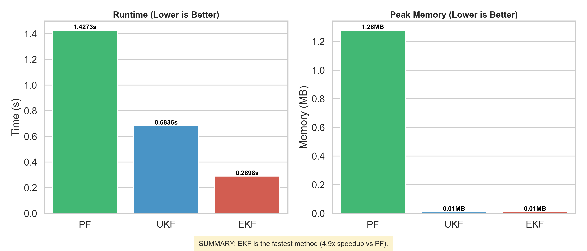

# Differentiable Particle Filtering

This project explores **particle filtering for state-space models** with a focus on making particle filters **differentiable and trainable end-to-end** using modern deep learning frameworks (TensorFlow).  
It combines classical Bayesian filtering (PF, EKF, UKF, KF) with ideas from **continuous relaxations of discrete sampling** (e.g. Gumbel-Softmax) to enable gradient-based learning.

The repository currently provides:
- A clean implementation of **Standard Particle Filtering (SIR)**
- **Extended Kalman Filter (EKF)** and **Unscented Kalman Filter (UKF)** baselines
- A **Stochastic Volatility (SV)** state-space model
- Benchmark scripts comparing accuracy and runtime
- A LaTeX report describing the theory and motivation for differentiable particle filters

---

## Motivation

Particle filters are powerful but difficult to integrate with gradient-based learning due to their **non-differentiable resampling step**.
This project investigates approaches to:

- Relax categorical resampling into **continuous, differentiable approximations**
- Enable **parameter learning** in state-space models using backpropagation
- Compare particle filtering with EKF/UKF in terms of performance and scalability

---

## Repository Structure

```
differentiable-particle-filtering/
│
├── src/
│   ├── filters/
│   │   ├── particle_filter.py   # Standard SIR particle filter
│   │   ├── ekf.py               # Extended Kalman Filter
│   │   ├── ukf.py               # Unscented Kalman Filter
│   │   └── kf.py                # Kalman Filter (linear Gaussian)
│   │
│   ├── models/
│   │   ├── state_space_model.py # Abstract model interface
│   │   ├── sv_model.py          # Stochastic Volatility model
│   │   └── lgssm.py             # Linear Gaussian SSM
│   │
│   └── utils/
│       └── helpers.py
│
├── examples/
│   ├── run_particle_filter.py   # Run PF on simulated data
│   ├── compare_perfromance.py   # PF vs EKF vs UKF benchmark
│   └── simulate_sv.py
│
├── reports/
│   └── filters.tex              # Theory and motivation (LaTeX)
│
├── requirements.txt
└── README.md
```

---

## Implemented Filters

- **Kalman Filter (KF)**  
  For linear Gaussian state-space models.

- **Extended Kalman Filter (EKF)**  
  Uses automatic differentiation to compute Jacobians.

- **Unscented Kalman Filter (UKF)**  
  Sigma-point based nonlinear filtering.

- **Particle Filter (SIR)**  
  Sequential Importance Resampling with ESS-based resampling.

> ⚠️ Note: The current particle filter uses *hard categorical resampling*.
> Differentiable resampling is discussed in the report and planned as an extension.

---

## Models

### Stochastic Volatility (SV) Model
The SV model is defined as:
```
x_t = α x_{t-1} + σ ε_t
y_t = β exp(x_t / 2) η_t
```
where:
- ε_t, η_t ~ N(0, 1)

The log-likelihood is implemented explicitly, making it suitable for particle filtering.

### Linear Gaussian State Space Model (LGSSM)
A standard linear dynamical system used primarily for KF/EKF/UKF benchmarks.

---

## Getting Started

### Installation

Create a virtual environment and install dependencies:

```bash
pip install -r requirements.txt
```

### Run Particle Filter Example

```bash
python examples/run_particle_filter.py
```

This will:
- Simulate data from the SV model
- Run the particle filter
- Plot filtered states and effective sample size (ESS)

### Benchmark Filters

```bash
python examples/compare_perfromance.py
```

This compares runtime and performance of:
- Particle Filter
- EKF
- UKF

A sample benchmark output is shown below.

---

## Benchmark Example



---

## Research Direction: Differentiable Particle Filtering

The accompanying LaTeX report (`reports/filters.tex`) discusses:
- Why resampling breaks differentiability
- Continuous relaxations using **Gumbel-Softmax / Concrete distributions**
- Strategies for end-to-end learning in particle filters

Planned extensions include:
- Differentiable (soft) resampling layers
- Parameter learning via gradient descent
- Comparison with non-resampled particle filters

---

## References

- Doucet, A., de Freitas, N., & Gordon, N. (2001). *Sequential Monte Carlo Methods in Practice*
- Maddison et al. (2017). *The Concrete Distribution*
- Jang et al. (2017). *Categorical Reparameterization with Gumbel-Softmax*

---

## Status

🚧 **Research / Experimental Project**  
This repository is intended for experimentation and learning rather than production use.

Contributions, extensions, and refactors are welcome.
